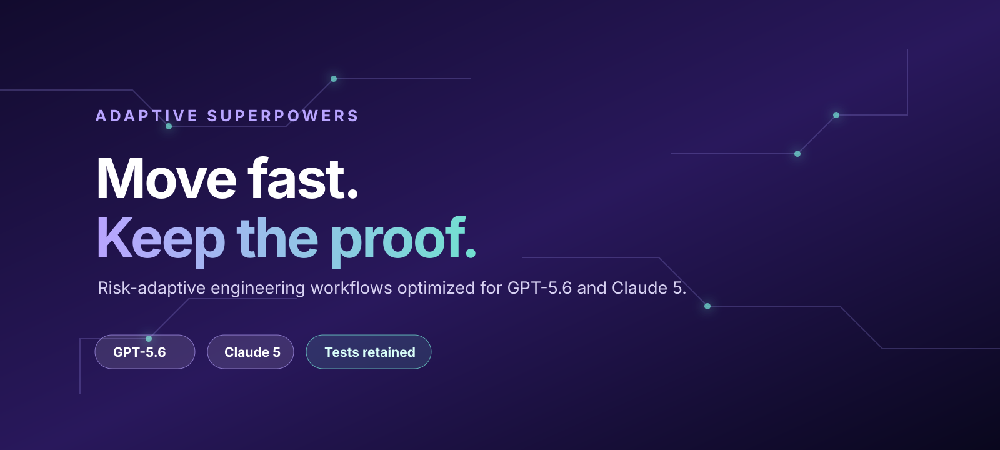
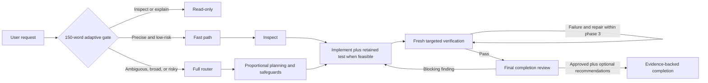

# Adaptive Superpowers



Risk-adaptive engineering workflows optimized for GPT-5.6 and Claude 5.

> Experimental 0.1.0: usable and tested across the target model matrix, but not an official obra/superpowers distribution.

## Install

### Choose your host

Installation follows the app that runs the agent, not the model name:

| You use | Install through | Applies to |
| --- | --- | --- |
| Codex Desktop or Codex CLI | Codex user skills | GPT-5.6 Sol, Terra, and other Codex models |
| Claude Code | Claude plugin marketplace | Claude Opus, Fable, and other Claude Code models |
| Claude Code for one temporary run | `--plugin-dir` | Only that Claude process |

You need Git plus a current Codex or Claude Code installation. The commands below use Bash or zsh on macOS/Linux; Windows users should run them inside WSL.

> [!IMPORTANT]
> Do not enable Adaptive Superpowers alongside another Superpowers installation. Both can inject a `using-superpowers` startup policy. Remove or disable the old installation first. In Claude Code, if the official plugin is enabled, run `claude plugin disable superpowers@claude-plugins-official`.

### Clone once

Both hosts can use the same clone:

```bash
REPO="$HOME/src/adaptive-superpowers"
mkdir -p "$HOME/src"
git clone https://github.com/aididhaiqal/adaptive-superpowers.git "$REPO"
```

If that directory already exists, do not clone over it; use the [update steps](#update).

### Install on Codex

Codex Desktop and Codex CLI share the same user-skill directory. This preflights every destination before creating any link, so an existing or dangling skill is never overwritten.

```bash
REPO="$HOME/src/adaptive-superpowers"
mkdir -p "$HOME/.agents/skills"

for skill in "$REPO"/skills/*; do
  test -f "$skill/SKILL.md" || continue
  name="$(basename "$skill")"
  if [[ -e "$HOME/.agents/skills/$name" || -L "$HOME/.agents/skills/$name" ]]; then
    echo "Refusing to overwrite $name" >&2
    exit 1
  fi
done

for skill in "$REPO"/skills/*; do
  test -f "$skill/SKILL.md" || continue
  ln -s "$skill" "$HOME/.agents/skills/$(basename "$skill")"
done
```

Close and reopen Codex, then start a new task. Existing tasks may retain skills already loaded into their context.

### Install on Claude Code

For a persistent user installation:

```bash
REPO="$HOME/src/adaptive-superpowers"
claude plugin marketplace add "$REPO"
claude plugin install adaptive-superpowers@adaptive-superpowers-dev
```

Restart Claude Code after installation. For one temporary run without installing:

```bash
REPO="$HOME/src/adaptive-superpowers"
claude --plugin-dir "$REPO"
```

Fable uses the same plugin; select it for that temporary run with:

```bash
claude --plugin-dir "$REPO" --model claude-fable-5
```

Opus needs no separate plugin or configuration—select the Opus model normally.

### Verify the installation

For Codex, confirm that the mandatory gate resolves into this clone:

```bash
REPO="$HOME/src/adaptive-superpowers"
test -L "$HOME/.agents/skills/using-superpowers"
test "$(readlink "$HOME/.agents/skills/using-superpowers")" = "$REPO/skills/using-superpowers"
echo "Adaptive Superpowers is linked for Codex"
```

For Claude Code, inspect the installed component inventory:

```bash
claude plugin details adaptive-superpowers@adaptive-superpowers-dev
```

The Claude output should show 12 skills and one `SessionStart` hook. Start a new Codex task or Claude session after installing or updating.

### Update

Update the shared clone without rewriting any Codex links:

```bash
REPO="$HOME/src/adaptive-superpowers"
git -C "$REPO" pull --ff-only
```

Codex follows the existing links automatically. For a persistent Claude installation, refresh the marketplace copy and plugin, then restart Claude Code:

```bash
claude plugin marketplace update adaptive-superpowers-dev
claude plugin update adaptive-superpowers@adaptive-superpowers-dev
```

### Remove

For Codex, unlink only entries that point at this clone:

```bash
REPO="$HOME/src/adaptive-superpowers"
for skill in "$REPO"/skills/*; do
  test -f "$skill/SKILL.md" || continue
  link="$HOME/.agents/skills/$(basename "$skill")"
  if [[ -L "$link" && "$(readlink "$link")" = "$skill" ]]; then
    unlink "$link"
  fi
done
```

For a persistent Claude installation:

```bash
claude plugin uninstall adaptive-superpowers@adaptive-superpowers-dev
claude plugin marketplace remove adaptive-superpowers-dev
```

These commands leave the clone intact. Delete it separately only if you no longer need it.

## Why

Capable coding models should not have to choose between speed and engineering evidence. Adaptive Superpowers fixes a small baseline for authorization, dirty-worktree safety, retained automated coverage when feasible, and evidence-backed completion. It adds process only when the request is ambiguous, broad, or risky.

Precise work stays direct; consequential work receives proportional planning and safeguards. This is an experimental adaptation, not an official obra/superpowers distribution.

## How it routes

A 150-word gate is always loaded and classifies the request before implementation. Read-only work remains read-only. A precise, low-risk change can take a fast path, while uncertainty or risk loads the full router.



## Optional Codex subagents

The core installation above does not require custom agents. Expand this section only if you want deterministic Codex roles for exploration and review.

<details>
<summary>Show the optional Terra and Sol agent profile</summary>

<br>

Adaptive Superpowers teaches the routing boundary: delegate one bounded read-only explorer only when bulky independent investigation would pollute the main context. Codex still owns orchestration and model selection. You can use its built-in agents without extra files, or make the explorer and reviewer deterministic with personal files under `~/.codex/agents/`. Project-only agents can instead live under `.codex/agents/` in that repository.

These model assignments are an optional Codex POC profile, not shared cross-host policy. The shared skills select roles by scope and availability; other hosts may use equivalent native agents.

Adaptive Superpowers does not set global thread or depth limits. For the first POC, keep any existing `[agents]` values in `~/.codex/config.toml` unchanged and observe the host's native orchestration. Codex still applies its own defaults when those settings are absent. Omission therefore means host-managed rather than literally unlimited. Tune personal or project configuration only after measuring the actual workload instead of making a bundle-wide policy.

Explorers and reviewers remain leaf agents because their instructions prohibit further delegation. Coordinators and workers may use deeper delegation when Codex and the user's configuration permit it.

Create `~/.codex/agents/explorer.toml`:

```toml
name = "explorer"
description = "Read-only explorer for broad repository scans, execution-path tracing, logs, and evidence gathering."
model = "gpt-5.6-terra"
model_reasoning_effort = "high"
sandbox_mode = "read-only"
developer_instructions = """
Stay read-only and answer the parent's precise question.
Prefer targeted searches and focused reads over broad output dumps.
Return concise evidence with file and symbol references plus explicit uncertainties.
Distinguish inspected code from commands or tests actually executed.
Never claim runtime behavior from inspection alone.
Mention at most one adjacent issue, only when it materially affects the request.
Do not estimate elapsed time, propose unrelated work, edit files, or delegate further.
"""
```

Naming this agent `explorer` overrides Codex's built-in explorer. Use it directly when useful:

```text
Use one read-only explorer to trace the deposit flow across ClientBFF, Payments,
and Ledger. Return concise file-and-symbol evidence, then keep decisions and edits
in the main agent.
```

For bounded feature review, create `~/.codex/agents/feature-reviewer.toml`:

```toml
name = "feature_reviewer"
description = "Read-only reviewer for a bounded material feature and its targeted evidence."
model = "gpt-5.6-terra"
model_reasoning_effort = "xhigh"
sandbox_mode = "read-only"
developer_instructions = """
Review the exact feature range, requirements, named risks, and targeted evidence.
Inspect affected callers, contracts, edge cases, regressions, and missing tests.
Separate supported blocking findings from material recommendations.
For each recommendation, cite evidence, expected value, and relevant cost or trade-off.
Do not include generic praise, speculative scope expansion, edits, or further delegation.
If no supported finding exists, say so plainly.
"""
```

Task review is selective, not a per-task ceremony. Within this optional Codex POC profile, use the Terra XHigh feature reviewer after focused verification when a bounded task carries material correctness, data, concurrency, contract, or cross-module risk. Routine and tightly coupled changes stay with the main agent. Security-sensitive, financial-ledger, migration, and consequential public-contract features should escalate directly to the strongest available reviewer.

For final integration review, create `~/.codex/agents/final-reviewer.toml`:

```toml
name = "final_reviewer"
description = "Read-only final reviewer for substantial branches, releases, and cross-feature integration risk."
model = "gpt-5.6-sol"
model_reasoning_effort = "high"
sandbox_mode = "read-only"
developer_instructions = """
Review the supplied merge base, whole change range, requirements, risks, and test evidence.
Prioritize cross-feature interaction, security, data, concurrency, migration, public contracts, and release blockers.
Validate every finding against the final code and evidence; do not repeat resolved task-review findings.
Separate supported blocking findings from material recommendations.
For each recommendation, cite evidence, expected value, and relevant cost or trade-off.
Do not include generic praise, speculative scope expansion, edits, or further delegation.
If no supported finding exists, say so plainly.
"""
```

Overall review is the integration gate for a substantial branch or release. Within this optional Codex POC profile, after final verification give one fresh Sol High final reviewer the merge base, exact diff range, requirements, named risks, and test evidence. Do not run automatic review/fix/re-review loops; re-review only when a substantial correction changes the risk surface.

```text
Review this branch from <merge-base> through HEAD against <requirements>.
Focus on <named risks>, inspect the final test evidence, and separate blocking
findings from material recommendations with evidence. Do not edit the branch.
```

Subagents can reduce main-context pollution and wall time for independent work, but they consume additional total tokens. Do not spawn one merely to satisfy the workflow.

</details>

## Tested models

These measured cohorts are recorded evaluation results, not universal speed claims:

| Model | Cohort | Retained tests | Median |
| --- | ---: | ---: | ---: |
| GPT-5.6 Sol Standard | 5 | 5/5 | 73.86s |
| GPT-5.6 Sol Fast | 5 | 5/5 | 55.47s |
| GPT-5.6 Terra Fast | 5 | 5/5 | 52.17s |
| Claude Opus 4.8 | 3 | 3/3 | 63.36s |
| Claude Fable 5 | 3 | 3/3 | 70.50s |

Fast mode uses 2.5 times ChatGPT credits. Acceptance is based on retained-test correctness across all four target models plus the sub-60-second Sol Fast cohort; it is not a claim that Standard met 60 seconds. See the [optimized-router evaluation summary](docs/evaluations/2026-07-22-optimized-adaptive-router.md) for the qualification and cohort details.

## What remains mandatory

Every task is classified to the highest applicable tier. Review-only and diagnosis-only requests are read-only; destructive or externally visible actions require authority. Behavior-changing work normally retains automated coverage for observable behavior, receives fresh targeted verification, and then receives a final review for missed requirements, integration gaps, and material recommendations before evidence-backed completion.

The model may choose proportional planning, strict red-green TDD, a worktree, independent review, or delegation when those add value. It may not skip authorization boundaries, dirty-worktree protection, applicable automated coverage, or honest reporting of review independence.

## Repository structure

```text
skills/                 shared gate, conditional router, and workflow policy
.codex-plugin/          Codex discovery metadata
.claude-plugin/         Claude Code plugin and marketplace metadata
hooks/                  Claude Code router bootstrap
adapters/               host-specific operating notes
profiles/               no model-specific overrides initially
tests/                  static, packaging, and behavioral contracts
```

There are 12 shared runtime skills. `skills/using-superpowers/SKILL.md` is the always-triggered gate; its full-router reference is loaded only when the fast-path predicate fails or scope grows.

## Development and verification

Run the complete repository suite before sharing a change:

```bash
bash tests/run-all.sh
git diff --check
```

For isolated host-adapter checks, stage into a new directory only:

```bash
bash scripts/stage-adapter.sh codex /tmp/adaptive-superpowers-codex
bash scripts/stage-adapter.sh claude /tmp/adaptive-superpowers-claude
```

The staging command refuses an existing destination and does not write to installed skills or user configuration.

## Evaluation methodology

Candidate runs precede baseline spending. Each run records the candidate commit, adapter, model identifier, CLI version, scenario, duration, tests, tool calls, skill loads, duplicated explanation or verification, and deterministic result. Missing access, authentication failure, rate limiting, or transcript-capture failure is indeterminate rather than a behavioral failure.

The two currently tracked executable scenarios are `adaptive-feature-retains-test` and `adaptive-bug-retains-regression`. Read-only diagnosis and review, dirty-worktree preservation, unavailable delegation, and evidence-backed completion remain planned broader coverage. Raw trajectories stay local; published summaries contain redacted evidence and aggregate metrics only. See [Architecture](docs/architecture.md), [Evaluation](docs/evaluation.md), and the [optimized-router evaluation summary](docs/evaluations/2026-07-22-optimized-adaptive-router.md).

## Provenance and license

Adaptive Superpowers is derived from MIT-licensed [obra/superpowers](https://github.com/obra/superpowers) and incorporates concise policy ideas from [eagleagentic/superpowers-gpt-5.6](https://github.com/eagleagentic/superpowers-gpt-5.6).

The initial audit and implementation are pinned to:

- official Superpowers 6.1.1: `d884ae04edebef577e82ff7c4e143debd0bbec99`
- GPT-5.6 fork: `aa973775906c8761a78019aaa21e4f0ccd987925`
- Superpowers eval harness: `58aaf6d118e4249eb0c9803e9f9d7df133b7639a`

Distributed under the [MIT License](LICENSE). “Superpowers” remains associated with its original project and authors; this experimental adaptation is not endorsed by them.
