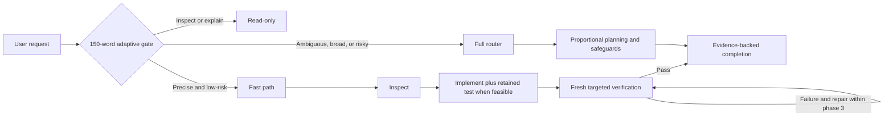

# Adaptive Superpowers


Risk-adaptive engineering workflows optimized for GPT-5.6 and Claude 5.

> Experimental 0.1.0: usable and tested across the target model matrix, but not an official obra/superpowers distribution.

## Why

Capable coding models should not have to choose between speed and engineering evidence. Adaptive Superpowers fixes a small baseline for authorization, dirty-worktree safety, retained automated coverage when feasible, and evidence-backed completion. It adds process only when the request is ambiguous, broad, or risky.

Precise work stays direct; consequential work receives proportional planning and safeguards. This is an experimental adaptation, not an official obra/superpowers distribution.

## How it routes

A 150-word gate is always loaded and classifies the request before implementation. Read-only work remains read-only. A precise, low-risk change can take a fast path, while uncertainty or risk loads the full router.



## Install

Clone from [aididhaiqal/adaptive-superpowers](https://github.com/aididhaiqal/adaptive-superpowers). The commands below refuse existing targets, so they never overwrite an installed skill or clone.

### Codex

Codex can use the canonical `skills/` tree directly. This installation symlinks every direct child that contains `SKILL.md` into `$HOME/.agents/skills`.

```bash
REPO="$HOME/src/adaptive-superpowers"
if [[ -e "$REPO" || -L "$REPO" ]]; then
  echo "Refusing to overwrite $REPO" >&2
  exit 1
fi
git clone https://github.com/aididhaiqal/adaptive-superpowers.git "$REPO"
mkdir -p "$HOME/.agents/skills"

for skill in "$REPO"/skills/*; do
  test -f "$skill/SKILL.md" || continue
  name="$(basename "$skill")"
  if [[ -e "$HOME/.agents/skills/$name" || -L "$HOME/.agents/skills/$name" ]]; then
    echo "Refusing to overwrite $name" >&2
    exit 1
  fi
done

for skill in "$REPO"/skills/*; do
  test -f "$skill/SKILL.md" || continue
  ln -s "$skill" "$HOME/.agents/skills/$(basename "$skill")"
done
```

### Claude Code

Claude Code loads a clone for one run with `claude --plugin-dir <clone>`:

```bash
REPO="$HOME/src/adaptive-superpowers"
if [[ -e "$REPO" || -L "$REPO" ]]; then
  echo "Refusing to overwrite $REPO" >&2
  exit 1
fi
git clone https://github.com/aididhaiqal/adaptive-superpowers.git "$REPO"
claude --plugin-dir "$REPO"
```

The repository also ships marketplace metadata in `.claude-plugin/marketplace.json` for local development:

```bash
claude plugin marketplace add /path/to/adaptive-superpowers
claude plugin install adaptive-superpowers@adaptive-superpowers-dev
```

Fable uses the Claude adapter with `--model claude-fable-5`; it is not a separate integration.

## Tested models

These measured cohorts are recorded evaluation results, not universal speed claims:

| Model | Cohort | Retained tests | Median |
| --- | ---: | ---: | ---: |
| GPT-5.6 Sol Standard | 5 | 5/5 | 73.86s |
| GPT-5.6 Sol Fast | 5 | 5/5 | 55.47s |
| GPT-5.6 Terra Fast | 5 | 5/5 | 52.17s |
| Claude Opus 4.8 | 3 | 3/3 | 63.36s |
| Claude Fable 5 | 3 | 3/3 | 70.50s |

Fast mode uses 2.5 times ChatGPT credits. Acceptance is based on retained-test correctness across all four target models plus the sub-60-second Sol Fast cohort; it is not a claim that Standard met 60 seconds. See the [optimized-router evaluation summary](docs/evaluations/2026-07-22-optimized-adaptive-router.md) for the qualification and cohort details.

## What remains mandatory

Every task is classified to the highest applicable tier. Review-only and diagnosis-only requests are read-only; destructive or externally visible actions require authority. Behavior-changing work normally retains automated coverage for observable behavior, receives fresh targeted verification, and ends with evidence-backed completion.

The model may choose proportional planning, strict red-green TDD, a worktree, independent review, or delegation when those add value. It may not skip authorization boundaries, dirty-worktree protection, applicable automated coverage, or honest reporting of review independence.

## Repository structure

```text
skills/                 shared gate, conditional router, and workflow policy
.codex-plugin/          Codex discovery metadata
.claude-plugin/         Claude Code plugin and marketplace metadata
hooks/                  Claude Code router bootstrap
adapters/               host-specific operating notes
profiles/               no model-specific overrides initially
tests/                  static, packaging, and behavioral contracts
```

There are 12 shared runtime skills. `skills/using-superpowers/SKILL.md` is the always-triggered gate; its full-router reference is loaded only when the fast-path predicate fails or scope grows.

## Development and verification

Run the complete repository suite before sharing a change:

```bash
bash tests/run-all.sh
git diff --check
```

For isolated host-adapter checks, stage into a new directory only:

```bash
bash scripts/stage-adapter.sh codex /tmp/adaptive-superpowers-codex
bash scripts/stage-adapter.sh claude /tmp/adaptive-superpowers-claude
```

The staging command refuses an existing destination and does not write to installed skills or user configuration.

## Evaluation methodology

Candidate runs precede baseline spending. Each run records the candidate commit, adapter, model identifier, CLI version, scenario, duration, tests, tool calls, skill loads, duplicated explanation or verification, and deterministic result. Missing access, authentication failure, rate limiting, or transcript-capture failure is indeterminate rather than a behavioral failure.

The two currently tracked executable scenarios are `adaptive-feature-retains-test` and `adaptive-bug-retains-regression`. Read-only diagnosis and review, dirty-worktree preservation, unavailable delegation, and evidence-backed completion remain planned broader coverage. Raw trajectories stay local; published summaries contain redacted evidence and aggregate metrics only. See [Architecture](docs/architecture.md), [Evaluation](docs/evaluation.md), and the [optimized-router evaluation summary](docs/evaluations/2026-07-22-optimized-adaptive-router.md).

## Provenance and license

Adaptive Superpowers is derived from MIT-licensed [obra/superpowers](https://github.com/obra/superpowers) and incorporates concise policy ideas from [eagleagentic/superpowers-gpt-5.6](https://github.com/eagleagentic/superpowers-gpt-5.6).

The initial audit and implementation are pinned to:

- official Superpowers 6.1.1: `d884ae04edebef577e82ff7c4e143debd0bbec99`
- GPT-5.6 fork: `aa973775906c8761a78019aaa21e4f0ccd987925`
- Superpowers eval harness: `58aaf6d118e4249eb0c9803e9f9d7df133b7639a`

Distributed under the [MIT License](LICENSE). “Superpowers” remains associated with its original project and authors; this experimental adaptation is not endorsed by them.
