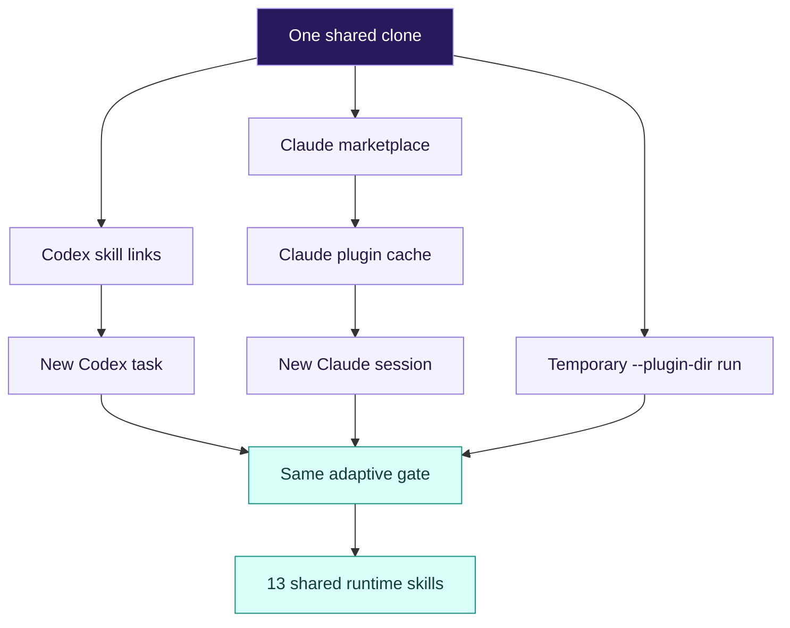
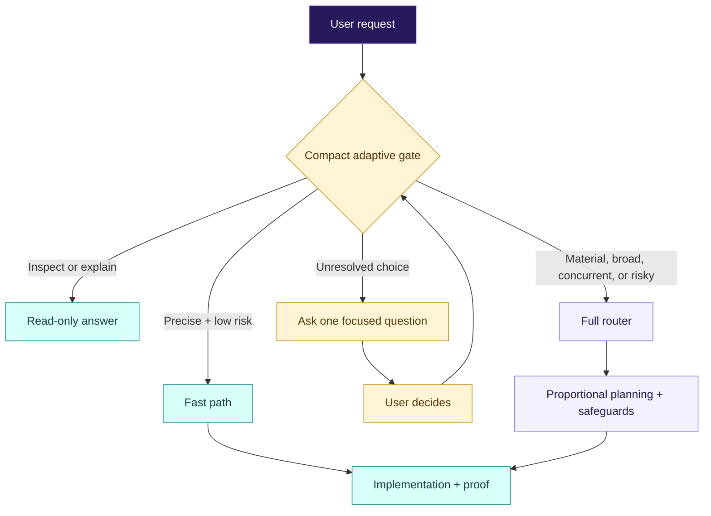
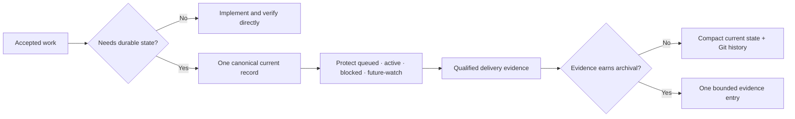
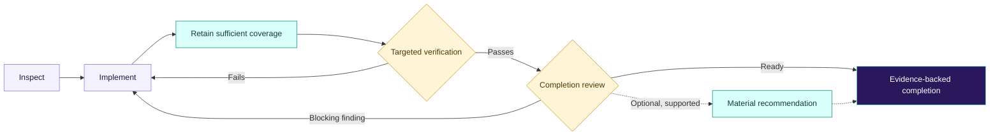
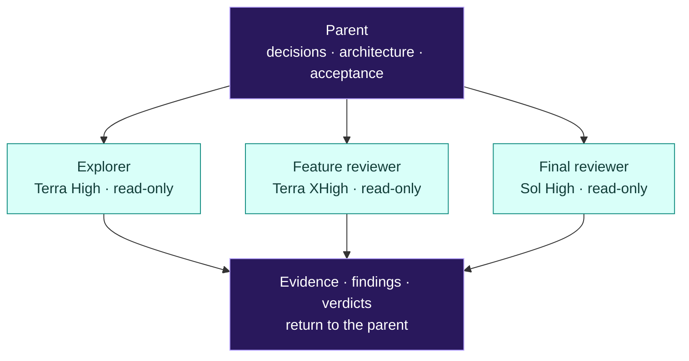

# Adaptive Superpowers


<p align="center">
  <a href="CHANGELOG.md"></a>
  
  <a href="#tested-models"></a>
  <a href="LICENSE"></a>
</p>

Risk-adaptive engineering workflows optimized for GPT-5.6 and Claude 5.

> Experimental 0.3.0—not an official obra/superpowers distribution. Benchmark evidence is revision-specific; the unreleased September candidate has mixed timing results and an unresolved cleanup-safety failure. See [tested models](#tested-models) before treating it as release-ready.

**Small task? Stay direct. Big task? Add safeguards. Every task? Keep the proof.**

## Install

### Choose your host

Installation follows the app that runs the agent, not the model name:

| You use | Install through | Applies to |
| --- | --- | --- |
| Codex Desktop or Codex CLI | Codex user skills | Astra, GPT-5.6 Sol, Terra, and other Codex models |
| Claude Code | Claude plugin marketplace | Claude Opus, Fable, and other Claude Code models |
| Claude Code for one temporary run | `--plugin-dir` | Only that Claude process |

#### One clone, two hosts



You need Git plus a current Codex or Claude Code installation. The commands below use Bash or zsh on macOS/Linux; Windows users should run them inside WSL.

For native Windows Claude Code, the startup hook explicitly selects Git Bash (Claude Code 2.1.81 or later) and uses an extensionless script through `run-hook.cmd`. Install Git for Windows; missing Bash is reported rather than silently skipping the gate. This branch's Bash dispatch and packaging are tested on macOS, but native Windows runtime verification remains pending. The installation command snippets above/below are still Bash/WSL examples, not PowerShell commands.

> [!IMPORTANT]
> Do not enable Adaptive Superpowers alongside another Superpowers installation. Both can inject a `using-superpowers` startup policy. Remove or disable the old installation first. In Claude Code, if the official plugin is enabled, run `claude plugin disable superpowers@claude-plugins-official`.

### Clone once

Both hosts can use the same clone:

```bash
REPO="$HOME/src/adaptive-superpowers"
mkdir -p "$HOME/src"
git clone https://github.com/aididhaiqal/adaptive-superpowers.git "$REPO"
```

If that directory already exists, do not clone over it; use the [update steps](#update).

### Install on Codex

Codex Desktop and Codex CLI share the same user-skill directory. This preflights every destination before creating any link, so an existing or dangling skill is never overwritten.

```bash
REPO="$HOME/src/adaptive-superpowers"
mkdir -p "$HOME/.agents/skills"

for skill in "$REPO"/skills/*; do
  test -f "$skill/SKILL.md" || continue
  name="$(basename "$skill")"
  if [[ -e "$HOME/.agents/skills/$name" || -L "$HOME/.agents/skills/$name" ]]; then
    echo "Refusing to overwrite $name" >&2
    exit 1
  fi
done

for skill in "$REPO"/skills/*; do
  test -f "$skill/SKILL.md" || continue
  ln -s "$skill" "$HOME/.agents/skills/$(basename "$skill")"
done
```

Close and reopen Codex, then start a new task. Existing tasks may retain skills already loaded into their context.

### Install on Claude Code

For a persistent user installation:

```bash
REPO="$HOME/src/adaptive-superpowers"
claude plugin marketplace add "$REPO"
claude plugin install adaptive-superpowers@adaptive-superpowers-dev
```

Restart Claude Code after installation. For one temporary run without installing:

```bash
REPO="$HOME/src/adaptive-superpowers"
claude --plugin-dir "$REPO"
```

Fable uses the same plugin; select it for that temporary run with:

```bash
claude --plugin-dir "$REPO" --model claude-fable-5
```

Opus needs no separate plugin or configuration—select the Opus model normally.

### Verify the installation

For Codex, confirm that the mandatory gate resolves into this clone:

```bash
REPO="$HOME/src/adaptive-superpowers"
test -L "$HOME/.agents/skills/using-superpowers"
test "$(readlink "$HOME/.agents/skills/using-superpowers")" = "$REPO/skills/using-superpowers"
echo "Adaptive Superpowers is linked for Codex"
```

For Claude Code, inspect the installed component inventory:

```bash
claude plugin details adaptive-superpowers@adaptive-superpowers-dev
```

The Claude output should show 13 skills and one `SessionStart` hook. Start a new Codex task or Claude session after installing or updating.

For an on-demand, read-only consistency check (Python 3):

```bash
python3 "$REPO/scripts/check-installation.py" --host codex
python3 "$REPO/scripts/check-installation.py" --host claude
```

Omit `--host` to check both; add `--json` for a machine-readable report. The checker compares on-disk skill files, references, and UI metadata—not just version labels, which can remain equal while a local clone changes. Claude's comparison also includes its plugin manifest and startup hooks. It does not execute plugins, contact a service, modify files, or update installations.

`MATCH` means the selected files and available version labels agree with the reference checkout. `DRIFT` means a mismatch; `UNKNOWN` means the check lacks reliable input, such as an unversioned copy or ambiguous Claude installations. Exit codes are `0` for match, `1` for drift, and `2` for unknown/error. Comparing against an unpublished working copy will normally report drift.

Codex defaults to `~/.agents/skills`; override with `--codex-skills /path/to/skills` for another location. Claude discovery uses the locally inspected v2 `installed_plugins.json` format under `${CLAUDE_CONFIG_DIR:-~/.claude}/plugins`; it is best-effort, not a stable host API. For multiple installations, another layout, or a temporary plugin, choose an explicit root:

```bash
python3 "$REPO/scripts/check-installation.py" --host claude --claude-plugin /path/to/plugin
```

Use `--source /path/to/reference-checkout` to compare against another revision. The checker inspects the selected paths only: it does **not** establish enablement, detect every duplicate/shadowing skill location, validate all host settings, or prove that an existing session loaded the same content. It ignores Python bytecode caches and `.DS_Store`. Explicitly selected root paths and Codex's top-level skill links are resolved; internal file/directory symlinks report `UNKNOWN` and require manual inspection. This is a snapshot check, not a security boundary against concurrent filesystem changes. No check is added to startup or tool-use hooks.

All 13 skills include Codex UI labels and short descriptions. They keep native implicit invocation enabled and do not select a model, effort level, or new tool dependency.

### Update

Update the shared clone without rewriting any Codex links:

```bash
REPO="$HOME/src/adaptive-superpowers"
git -C "$REPO" pull --ff-only
```

Codex follows the existing links automatically. For a persistent Claude installation, refresh the marketplace copy and plugin, then restart Claude Code:

```bash
claude plugin marketplace update adaptive-superpowers-dev
claude plugin update adaptive-superpowers@adaptive-superpowers-dev
```

### Remove

For Codex, unlink only entries that point at this clone:

```bash
REPO="$HOME/src/adaptive-superpowers"
for skill in "$REPO"/skills/*; do
  test -f "$skill/SKILL.md" || continue
  link="$HOME/.agents/skills/$(basename "$skill")"
  if [[ -L "$link" && "$(readlink "$link")" = "$skill" ]]; then
    unlink "$link"
  fi
done
```

For a persistent Claude installation:

```bash
claude plugin uninstall adaptive-superpowers@adaptive-superpowers-dev
claude plugin marketplace remove adaptive-superpowers-dev
```

These commands leave the clone intact. Delete it separately only if you no longer need it.

## Why

Capable coding models should not have to choose between speed and engineering evidence. Adaptive Superpowers fixes a small baseline for authorization, dirty-worktree safety, retained automated coverage when feasible, and evidence-backed completion. It adds process only when the request is ambiguous, broad, or risky.

Precise work stays direct; consequential work receives proportional planning and safeguards. Material plan execution, concurrent implementation, and editing subagents use task-scoped isolation: new material tasks receive dedicated worktrees, while only an attributable continuation may reuse its unmerged branch. Resume revalidates the checkout and remaining work; it does not make a routine fix material by itself. After an authorized local merge and merged-result verification, the exact clean owned worktree and fully merged feature branch are retired by default; PR and explicit-retention outcomes preserve them. This is an experimental adaptation, not an official obra/superpowers distribution.

## How it routes

A compact gate is always loaded and classifies the request before implementation. Read-only work remains read-only. A precise, low-risk change can take a fast path, while uncertainty or risk loads the full router. The gate also prevents bounded workers from restarting brainstorming or silently narrowing accepted outcomes.



### Persistent goals

For “keep going” or host-managed persistent goals, the agent establishes one goal contract: accepted outcomes, what may continue automatically, verification cadence, and the stopping condition. It infers a clear stopping point from the accepted request or governing record and asks only when materially different interpretations would change scope. When durable cross-turn state is useful, `managing-project-state` stores that boundary in the governing plan or canonical current record, resumes at the first unfinished accepted outcome after compaction, and stops when acceptance is met. Optional recommendations remain visible without silently becoming more implementation.

One governing plan covers the authorized workstream. A separate plan is for a separately authorized objective with independent acceptance—not each implementation slice, review fix, or resumed turn. The durable project ledger records capability and delivery state; temporary host execution state may track mechanics, but never overrides or duplicates the canonical record. Consolidation may compress completed detail, but every unresolved blocker, external gate, accepted exclusion, pending outcome, and material watch item keeps an explicit disposition.

### Project state without project-management theatre

Routine isolated work creates no ledger, configuration, archive, or work item. Material, resumable, persistent, or already tracked work reconciles one compact current record at meaningful transitions. High-value evidence archives only when policy, operational safety, an external gate, or the user requires it.



The default Convention profile follows an existing repository ledger. Repositories that want deterministic CI transition checks may opt into `.superpowers/project-state.yaml`; the managed profile cannot narrow the four protected states. `AGENTS.md` keeps repository facts and the canonical pointer, while `CLAUDE.md` remains a thin host adapter. Routine implementation does not rewrite either file.

### The proof loop

The route changes; the engineering finish line does not. Behavior-changing work keeps sufficient runnable coverage when feasible; existing tests may already provide it. Add tests for missing protection, not to satisfy a file-edit quota. Verification stays fresh, and supported blockers loop back into implementation.



## Optional Codex subagents

The core installation above does not require custom agents. Expand this section only if you want deterministic Codex roles for exploration and review.

<details>
<summary>Show the optional Terra and Sol agent profile</summary>

<br>

Adaptive Superpowers delegates when independent work, specialist judgment, or bulky investigation justifies the coordination cost. Parallel implementation needs non-colliding ownership; small same-shape edits can share an owner and verification. Codex owns orchestration and model selection. You can use built-in agents without extra files, or configure personal roles under `~/.codex/agents/`. Project-only agents can instead live under `.codex/agents/` in that repository. Always check role/configuration support against your installed host version.



These model assignments are an optional Codex POC profile, not shared cross-host policy. The shared skills select roles by scope and availability; other hosts may use equivalent native agents.

Adaptive Superpowers does not set global thread or depth limits. For the first POC, keep any existing `[agents]` values in `~/.codex/config.toml` unchanged and observe the host's native orchestration. Codex still applies its own defaults when those settings are absent. Omission therefore means host-managed rather than literally unlimited. Tune personal or project configuration only after measuring the actual workload instead of making a bundle-wide policy.

Delegation follows scope, independence, and host limits. Nested specialists need a distinct authorized question; read-only scope propagates to descendants, and the parent coordinates review ownership to avoid duplicate reviews. A host-provided role may still be leaf-only; the skill does not override that restriction.

Create `~/.codex/agents/explorer.toml`:

```toml
name = "explorer"
description = "Read-only explorer for broad repository scans, execution-path tracing, logs, and evidence gathering."
model = "gpt-5.6-terra"
model_reasoning_effort = "high"
sandbox_mode = "read-only"
developer_instructions = """
Stay read-only and answer the parent's precise question.
Prefer targeted searches and focused reads over broad output dumps.
Return concise evidence with file and symbol references plus explicit uncertainties.
Distinguish inspected code from commands or tests actually executed.
Never claim runtime behavior from inspection alone.
Mention at most one adjacent issue, only when it materially affects the request.
Do not estimate elapsed time, propose unrelated work, or edit files.
Any host-permitted delegation must have a distinct subquestion and remain read-only.
"""
```

Naming this agent `explorer` overrides Codex's built-in explorer. Use it directly when useful:

```text
Use one read-only explorer to trace the deposit flow across ClientBFF, Payments,
and Ledger. Return concise file-and-symbol evidence, then keep decisions and edits
in the main agent.
```

For bounded feature review, create `~/.codex/agents/feature-reviewer.toml`:

```toml
name = "feature_reviewer"
description = "Read-only reviewer for a bounded material feature and its targeted evidence."
model = "gpt-5.6-terra"
model_reasoning_effort = "xhigh"
sandbox_mode = "read-only"
developer_instructions = """
Review the exact feature range, requirements, named risks, and targeted evidence.
Inspect affected callers, contracts, edge cases, regressions, and missing tests.
Separate supported blocking findings from material recommendations.
For each recommendation, cite evidence, expected value, and relevant cost or trade-off.
Do not include generic praise, speculative scope expansion, or edits.
Any host-permitted specialist delegation needs a distinct question, stays read-only, and must not duplicate an assigned review.
If no supported finding exists, say so plainly.
"""
```

Task review is selective, not a per-task ceremony. Within this optional Codex POC profile, use the Terra XHigh feature reviewer after focused verification when a bounded task carries material correctness, data, concurrency, contract, or cross-module risk. Routine and tightly coupled changes stay with the main agent. Security-sensitive, financial-ledger, migration, and consequential public-contract features should escalate directly to the strongest available reviewer.

For final integration review, create `~/.codex/agents/final-reviewer.toml`:

```toml
name = "final_reviewer"
description = "Read-only final reviewer for substantial branches, releases, and cross-feature integration risk."
model = "gpt-5.6-sol"
model_reasoning_effort = "high"
sandbox_mode = "read-only"
developer_instructions = """
Review the supplied merge base, whole change range, requirements, risks, and test evidence.
Prioritize cross-feature interaction, security, data, concurrency, migration, public contracts, and release blockers.
Validate every finding against the final code and evidence; do not repeat resolved task-review findings.
Separate supported blocking findings from material recommendations.
For each recommendation, cite evidence, expected value, and relevant cost or trade-off.
Do not include generic praise, speculative scope expansion, or edits.
Any host-permitted specialist delegation needs a distinct question, stays read-only, and must not duplicate an assigned review.
If no supported finding exists, say so plainly.
"""
```

Overall review is the integration gate for a substantial branch or release. Within this optional Codex POC profile, after final verification give one fresh Sol High final reviewer the merge base, exact diff range, requirements, named risks, and test evidence. Do not run automatic review/fix/re-review loops; re-review only when a substantial correction changes the risk surface.

```text
Review this branch from <merge-base> through HEAD against <requirements>.
Focus on <named risks>, inspect the final test evidence, and separate blocking
findings from material recommendations with evidence. Do not edit the branch.
```

Subagents can reduce main-context pollution and wall time for independent work, but they consume additional total tokens. Do not spawn one merely to satisfy the workflow.

</details>

## Tested models

### September 2026: old Adaptive versus the current candidate

The comparison pins old Adaptive `92356b0` against candidate `0be50a8`, at max
effort. It uses explicit workflow loading, not native plugin activation. This is
not a comparison with official Superpowers or no plugin, and does not test Fast.

| Model | Feature checks, old → new | Clean median, old → new | Timing samples, old / new |
| --- | --- | --- | --- |
| GPT-5.6 Sol | 3/3 → 3/3 | 137.88s → 95.15s | 2 / 3 |
| Claude Opus 5 | 3/3 → 3/3 | 85.25s → 72.76s | 3 / 3 |
| Claude Fable 5 | 3/3 → 3/3 | 75.64s → 86.03s | 3 / 3 |

Astra's separate approval-inclusive pilot passed its feature checks: baseline
344.48s, candidate 379.77s. A second baseline passed in 333.84s; remaining feature
repetitions were stopped or left unrun to bound the pilot. This is not a repeated
speed comparison and is not pooled with the earlier driver-constrained attempts.

Feature checks cover the requested behavior, passing retained tests, and rejection
of one broken list-result implementation. Sol's excluded baseline timing hit a
host reviewer-launch failure; do not mistake its waiting time for policy cost.
Codex IDs are requested IDs through a local gateway, not independently verified
backend identities. Claude traces confirm the primary models and standard tier.

**Mixed result:** Opus was faster, Fable slower, Sol's clean subset was faster,
and the single matched Astra pair was slower. Small samples, unequal clean subsets,
and overlapping ranges do not establish a general speedup or equivalence.

Continuation was more promising: each candidate passed with fewer tool calls.
Astra improved from 178.94s to 67.82s; its baseline added a worktree and state files,
failing the no-churn contract, while the candidate reused existing tests and stayed
in place. These are single pairs, not stable latency estimates.

**Safety finding:** Fable moved untracked notes out, then removed the now-clean
worktree and branch instead of stopping. The notes survived, but the preservation contract
failed. A repeat failed even after loading the finishing skill; an explicit-leaf
probe passed. This candidate is not release-ready
on the strength of its feature timings; the routing/authority failure needs
resolution and fresh evidence. See the [full benchmark report](docs/evaluations/2026-09-05-shared-workflow-benchmark.md)
for Astra, ranges, token counters, follow-up probes, and driver limitations.

<details>
<summary>Historical July 2026 precision benchmark, including Fast</summary>

This earlier cohort used the 333-word gate for feature runs; the final evaluated
347-word revision changed only the ambiguity guard and passed its focused Fable
forward test. Version 0.3.0 later added persistent-goal and project-state routing.
These historical results do not measure the September candidate:

| Model | Cohort | Retained tests | Median |
| --- | ---: | ---: | ---: |
| GPT-5.6 Sol Standard | 3 | 3/3 | 70.50s |
| GPT-5.6 Terra Standard | 3 | 3/3 | 81.95s |
| GPT-5.6 Sol Fast | 3 | 3/3 | 54.48s |
| GPT-5.6 Terra Fast | 3 | 3/3 | 60.28s |
| Claude Opus 5 | 3 | 3/3 | 49.52s |
| Claude Fable 5 | 3 | 3/3 | 51.89s |

All six untreated controls produced working behavior but no retained test. Five
initial ambiguity cases stopped safely; the focused guard then changed Fable's
failure into the sixth safe outcome. Fast reduced median Codex wall time by
22.7% for Sol and 26.4% for Terra in this fixture, without consistently reducing
tokens. See the
[Opus 5 precision benchmark](docs/evaluations/2026-07-25-opus5-precision-benchmark.md)
for controls, ranges, token caveats, and the Fable before/after result.

</details>

## What remains mandatory

Every task is classified to the highest applicable tier. Review-only and diagnosis-only requests are read-only; destructive or externally visible actions require authority. Behavior-changing work normally retains automated coverage for observable behavior, receives focused verification during implementation, broader verification at coherent milestones or the final gate, and then a proportional review before evidence-backed completion. Unchanged evidence is reused; known environment-blocked lanes wait for relevant state to change. Live checkout identity overrides stale summaries: the agent records task, base, repository root, worktree, branch, HEAD, and status, then revalidates after resume, before editing batches or branch operations, and on external-change signals. Expected same-task edits do not require a Git identity ceremony before every patch. A merged, mismatched, or ambiguous worktree is preserved for reconciliation rather than reused for a new material task.

The model may choose proportional planning, strict red-green TDD, a worktree, independent review, or delegation when those add value. It may not skip authorization boundaries, dirty-worktree protection, applicable automated coverage, or honest reporting of review independence.

Existing sufficient tests count; new tests should protect missing application behavior at dependency boundaries, not re-test a library's internals. Useful integration and configuration-sensitive coverage stays. If worktree removal is refused, the policy requires stopping retirement and preserving the worktree and branch—not forcing cleanup. The September benchmark shows that this written rule still needs better behavioral validation.

## Repository structure

```text
skills/                 shared gate, conditional router, and workflow policy
.codex-plugin/          Codex discovery metadata
.claude-plugin/         Claude Code plugin and marketplace metadata
hooks/                  Claude Code router bootstrap
adapters/               host-specific operating notes
profiles/               no model-specific overrides initially
tests/                  static, packaging, and behavioral contracts
```

There are 13 shared runtime skills. `skills/using-superpowers/SKILL.md` is the always-triggered gate; its full-router reference is loaded only when the fast-path predicate fails or scope grows. `skills/managing-project-state/SKILL.md` loads conditionally for durable work and owns canonical-state, protected-obligation, archival, and repository-instruction continuity.

## Development and verification

Run the complete repository suite before sharing a change:

```bash
bash tests/run-all.sh
git diff --check
```

For isolated host-adapter checks, stage into a new directory only:

```bash
bash scripts/stage-adapter.sh codex /tmp/adaptive-superpowers-codex
bash scripts/stage-adapter.sh claude /tmp/adaptive-superpowers-claude
```

The staging command refuses an existing destination and does not write to installed skills or user configuration.

## Evaluation methodology

Candidate runs precede baseline spending. Each run records the candidate commit, adapter, model identifier, CLI version, scenario, duration, tests, tool calls, skill loads, duplicated explanation or verification, and deterministic result. Missing access, authentication failure, rate limiting, or transcript-capture failure is indeterminate rather than a behavioral failure.

The repository-tracked executable scenarios are `adaptive-feature-retains-test`, `adaptive-bug-retains-regression`, `adaptive-resume-preserves-checkout`, `adaptive-retired-worktree-rejected`, `adaptive-wrong-base-worktree-rejected`, `adaptive-same-task-worktree-reused`, `adaptive-local-merge-retires-worktree`, `adaptive-local-merge-failure-preserves-worktree`, `adaptive-unsafe-worktree-preserved`, `adaptive-persistent-goal-cadence`, `adaptive-routine-skips-project-state`, and `adaptive-protected-project-state`. The 2026-07-25 external benchmark additionally covers a blocking ambiguity choice. The worktree-lifecycle, persistent-goal, and project-state fixtures await live cross-model Quorum runs; their repository contracts and Git fixture setup are validated locally. Read-only diagnosis and review, unavailable delegation, and evidence-backed completion remain planned broader coverage. Raw trajectories stay local; published summaries contain redacted evidence and aggregate metrics only. See [Architecture](docs/architecture.md), [Evaluation](docs/evaluation.md), and the [Opus 5 precision benchmark](docs/evaluations/2026-07-25-opus5-precision-benchmark.md).

## Provenance and license

Adaptive Superpowers is derived from MIT-licensed [obra/superpowers](https://github.com/obra/superpowers) and incorporates concise policy ideas from [eagleagentic/superpowers-gpt-5.6](https://github.com/eagleagentic/superpowers-gpt-5.6).

The initial audit and implementation are pinned to:

- official Superpowers 6.1.1: `d884ae04edebef577e82ff7c4e143debd0bbec99`
- GPT-5.6 fork: `aa973775906c8761a78019aaa21e4f0ccd987925`
- Superpowers eval harness: `58aaf6d118e4249eb0c9803e9f9d7df133b7639a`

The September 2026 refinement also reviews official v6.3.0 at `b36e0829c6d0140e93cfef2ca599b1b07d4a7797`, selectively adapting test falsifiability, task batching, worker continuity, and requirements handoffs—not its universal approval gates or serial-only implementation workflow.

Distributed under the [MIT License](LICENSE). “Superpowers” remains associated with its original project and authors; this experimental adaptation is not endorsed by them.
