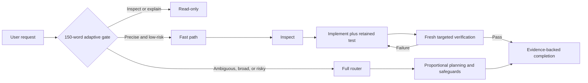

# Public README and GitHub Launch Implementation Plan

> **For agentic workers:** REQUIRED SUB-SKILL: Use superpowers:subagent-driven-development (recommended) or superpowers:executing-plans to implement this plan task-by-task. Steps use checkbox (`- [ ]`) syntax for tracking.

**Goal:** Publish `aididhaiqal/adaptive-superpowers` as a public, installable repository with a product-first README, branded hero image, maintainable Mermaid routing diagram, and evidence-backed model results.

**Architecture:** Keep behavioral policy in the existing `skills/` tree. Add one static SVG for durable project identity, express evolving routing behavior in Mermaid, and verify the public documentation through the existing repository contract. Publish the validated current history as the new repository's `main` branch without ignored evaluation trajectories or brainstorming artifacts.

**Tech Stack:** Markdown, Mermaid, SVG, Bash repository contracts, Git, GitHub CLI.

## Global Constraints

- Public repository: `aididhaiqal/adaptive-superpowers`.
- Public title: “Adaptive Superpowers”.
- Positioning: “Risk-adaptive engineering workflows optimized for GPT-5.6 and Claude 5.”
- Hero message: “Move fast. Keep the proof.”
- Images communicate durable identity; Mermaid communicates evolving behavior.
- Version 0.1.0 is experimental but usable.
- Do not claim official endorsement or universal performance improvements.
- Keep credentials, raw model trajectories, and `.superpowers/` state out of Git.
- Preserve the pinned provenance identifiers already required by repository tests.

---

### Task 1: Define the public README contract

**Files:**
- Modify: `.gitignore`
- Modify: `tests/static/test-repository-contract.sh`
- Test: `tests/static/test-repository-contract.sh`

**Interfaces:**
- Consumes: the existing static repository contract and approved README design.
- Produces: executable requirements for the hero, public positioning, installation, Mermaid routing, and public repository URL.

- [ ] **Step 1: Ignore visual-companion state**

Append this exact line to `.gitignore`:

```gitignore
.superpowers/
```

- [ ] **Step 2: Add failing README and asset assertions**

Add these checks after `test -f "$ROOT/LICENSE"` in `tests/static/test-repository-contract.sh`:

```bash
test -f "$ROOT/assets/adaptive-superpowers-hero.svg"
grep -Fq 'Move fast. Keep the proof.' "$ROOT/assets/adaptive-superpowers-hero.svg"
grep -Fq 'Risk-adaptive engineering workflows optimized for GPT-5.6 and Claude 5.' "$ROOT/README.md"
grep -Fq 'aididhaiqal/adaptive-superpowers' "$ROOT/README.md"
grep -Fq '## Install' "$ROOT/README.md"
grep -Fq '```mermaid' "$ROOT/README.md"
grep -Fq '150-word adaptive gate' "$ROOT/README.md"
```

- [ ] **Step 3: Run the contract and confirm the intended failure**

Run: `bash tests/static/test-repository-contract.sh`

Expected: non-zero exit because `assets/adaptive-superpowers-hero.svg` does not exist.

- [ ] **Step 4: Commit the failing contract**

```bash
git add .gitignore tests/static/test-repository-contract.sh
git commit -m "test: define public README contract"
```

### Task 2: Build the public README and visual system

**Files:**
- Create: `assets/adaptive-superpowers-hero.svg`
- Modify: `README.md`
- Test: `tests/static/test-repository-contract.sh`

**Interfaces:**
- Consumes: the exact strings and asset path enforced by Task 1.
- Produces: a GitHub-renderable hero and canonical documentation for installation, routing, evaluation, architecture, and provenance.

- [ ] **Step 1: Create the branded SVG hero**

Create a 1600×720 SVG with `role="img"`, descriptive `<title>` and `<desc>`, a dark violet gradient, restrained circuit lines, the exact hero message, the positioning line, and pills for `GPT-5.6`, `Claude 5`, and `Tests retained`. Use system sans-serif fonts so the text renders without an external font dependency.

The accessible text must be:

```xml
<title id="title">Adaptive Superpowers</title>
<desc id="desc">Move fast. Keep the proof. Risk-adaptive workflows optimized for GPT-5.6 and Claude 5.</desc>
```

- [ ] **Step 2: Rewrite the README product-first**

Use this exact section order:

```markdown
# Adaptive Superpowers


Risk-adaptive engineering workflows optimized for GPT-5.6 and Claude 5.

> Experimental 0.1.0: usable and tested across the target model matrix, but not an official obra/superpowers distribution.

## Why
## How it routes
## Install
### Codex
### Claude Code
## Tested models
## What remains mandatory
## Repository structure
## Development and verification
## Evaluation methodology
## Provenance and license
```

Under `How it routes`, include this Mermaid source:



For Codex, document a non-overwriting clone-and-symlink installation into `$HOME/.agents/skills`, iterating over each direct child of `skills/` containing `SKILL.md`. For Claude Code, document a clone loaded with `claude --plugin-dir <clone>` and repository marketplace commands backed by `.claude-plugin/marketplace.json`. State that Fable uses the Claude adapter and is not a separate integration.

Report these measured results without presenting them as universal speed claims:

| Model | Cohort | Retained tests | Median |
| --- | ---: | ---: | ---: |
| GPT-5.6 Sol Fast | 5 | 5/5 | 55.47s |
| GPT-5.6 Terra Fast | 5 | 5/5 | 52.17s |
| Claude Opus 4.8 | 3 | 3/3 | 63.36s |
| Claude Fable 5 | 3 | 3/3 | 70.50s |

Preserve the three pinned provenance hashes and the phrase `observable behavior` required by the existing contract.

- [ ] **Step 3: Verify the focused contract passes**

Run: `bash tests/static/test-repository-contract.sh`

Expected: `repository contract passed` and exit 0.

- [ ] **Step 4: Run all repository checks and review the diff**

```bash
bash tests/run-all.sh
git diff --check
git diff --stat
git diff -- README.md assets/adaptive-superpowers-hero.svg .gitignore tests/static/test-repository-contract.sh
```

Expected: 12 skills, 150-word gate, 2,586 runtime words, all repository tests passed, no whitespace errors, and only intended files changed.

- [ ] **Step 5: Commit the public documentation**

```bash
git add README.md assets/adaptive-superpowers-hero.svg
git commit -m "docs: launch Adaptive Superpowers"
```

### Task 3: Audit and publish the repository

**Files:**
- Inspect: all paths from `git ls-files`
- External target: `https://github.com/aididhaiqal/adaptive-superpowers`

**Interfaces:**
- Consumes: the clean validated commit from Task 2 and authenticated GitHub CLI.
- Produces: a public GitHub repository whose default branch is `main`, with `origin` configured locally.

- [ ] **Step 1: Audit tracked publication contents**

```bash
git status --short --branch
git ls-files
git grep -nE 'gho_|sk-ant-|BEGIN (RSA|OPENSSH|EC) PRIVATE KEY|\.credentials' -- . ':!docs/superpowers/plans/2026-07-22-public-readme-and-github-launch.md'
git ls-files 'evals/results/**' '.superpowers/**'
```

Expected: clean worktree; no secret matches; ignored-artifact listing empty.

- [ ] **Step 2: Verify GitHub access and target availability**

```bash
gh auth status
gh repo view aididhaiqal/adaptive-superpowers
```

Expected: authenticated as `aididhaiqal`; repository not found before creation. If it exists, stop and inspect it instead of overwriting or force-pushing.

- [ ] **Step 3: Create the public repository without pushing automatically**

```bash
gh repo create aididhaiqal/adaptive-superpowers --public --source=. --remote=origin --description "Risk-adaptive engineering workflows optimized for GPT-5.6 and Claude 5"
```

Expected: repository created and `origin` points to `https://github.com/aididhaiqal/adaptive-superpowers.git`.

- [ ] **Step 4: Push the validated commit as main**

```bash
git push -u origin HEAD:main
gh repo edit aididhaiqal/adaptive-superpowers --default-branch main
```

Expected: remote `main` is created, upstream tracking succeeds, and GitHub's default branch is `main`.

- [ ] **Step 5: Verify the public result**

```bash
gh repo view aididhaiqal/adaptive-superpowers --json nameWithOwner,url,visibility,defaultBranchRef
git ls-remote --heads origin main
git status --short --branch
```

Expected: `PUBLIC`, the requested URL, `main` as default, remote `main` at local HEAD, and a clean worktree.
